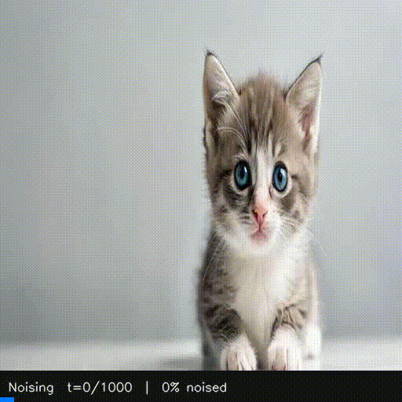
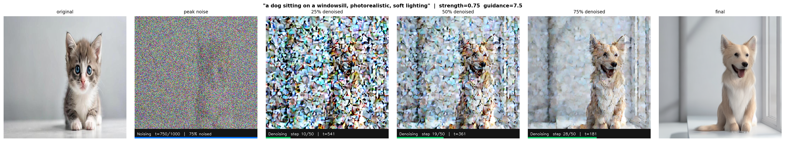

# 🌀 Diffusion Vision Guidance

Visual demonstration of the full diffusion process — takes a real image, progressively noises it, then denoises it back using text guidance with Stable Diffusion v1.5.



---

## What it does

| Phase | Description |
|---|---|
| 🔵 **Forward (Noising)** | Original image is progressively destroyed using the DDPM forward process |
| 🟢 **Reverse (Denoising)** | Noised image is reconstructed step-by-step guided by a text prompt using DDIM + CFG |

The full journey is captured frame-by-frame and exported as a video.

---

## Preview Strip



> From left to right: original → peak noise → 25% denoised → 50% denoised → 75% denoised → final

---

## How it works

### Forward Pass — q(x_t | x_0)
At each timestep `t`, noise is added according to:

```
x_t = sqrt(ᾱ_t) * x_0  +  sqrt(1 - ᾱ_t) * ε
```

where `ε ~ N(0, I)` and `ᾱ_t` is the cumulative product of noise schedule betas.

### Reverse Pass — Classifier-Free Guidance (CFG)
At each denoising step, the UNet predicts noise twice:

```
ε_guided = ε_uncond + guidance_scale × (ε_cond - ε_uncond)
```

- `ε_uncond` — prediction with empty prompt
- `ε_cond` — prediction with your text prompt
- `guidance_scale` — how strongly to follow the prompt (7.5 = standard)

---

## Architecture

```
Text Prompt ──► CLIP Encoder ──► Text Embeddings
                                        │
Input Image ──► VAE Encoder ──► Latent ──► + Noise
                                        │
                               DDIM Reverse Loop
                               (50 steps, CFG guided)
                                        │
                               VAE Decoder ──► Output Image
```

---

## Usage

```bash
pip install diffusers transformers accelerate torch pillow matplotlib opencv-python
apt-get install -y ffmpeg
```

Edit the config at the top of `diffusion_video.py`:

```python
INPUT_IMAGE     = "your_image.jpg"
PROMPT          = "a dog sitting on a windowsill, photorealistic"
NEGATIVE_PROMPT = "blurry, low quality, distorted"
STRENGTH        = 0.75    # 0=no change, 1=full regeneration
GUIDANCE_SCALE  = 7.5     # 1=weak, 7.5=standard, 15=very strong
NUM_STEPS       = 50      # more steps = smoother video
```

Then run:

```bash
python diffusion_video.py
```

### Output files

| File | Description |
|---|---|
| `noise_denoise.mp4` | Full noising + denoising video |
| `diffusion.gif` | GIF version for README |
| `preview_strip.png` | 6-frame keyframe strip |
| `final_output.png` | Final generated image |
| `comparison.png` | Side-by-side input vs output |

---

## Model

| Component | Details |
|---|---|
| Base model | `runwayml/stable-diffusion-v1-5` |
| Scheduler | DDIM (Denoising Diffusion Implicit Models) |
| Text encoder | CLIP ViT-L/14 |
| Guidance | Classifier-Free Guidance (CFG) |

---

## References

- [Denoising Diffusion Probabilistic Models — Ho et al. 2020](https://arxiv.org/abs/2006.11239)
- [DDIM — Song et al. 2020](https://arxiv.org/abs/2010.02502)
- [Classifier-Free Diffusion Guidance — Ho & Salimans 2022](https://arxiv.org/abs/2207.12598)
- [Stable Diffusion — Rombach et al. 2022](https://arxiv.org/abs/2112.10752)
