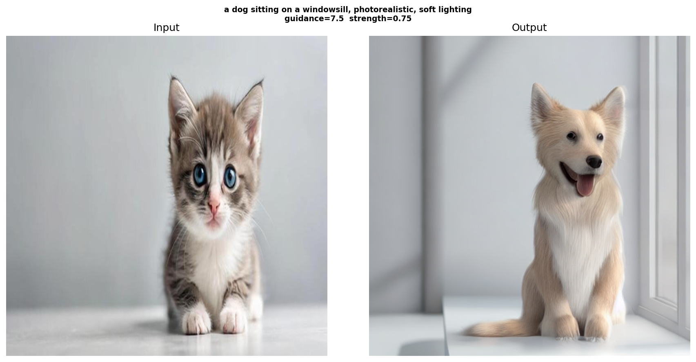

# Diffusion Vision Guidance

**Interactive visualization of the complete diffusion process** — forward noising and reverse denoising with text guidance using Stable Diffusion v1.5.


https://github.com/Khushangz/Diffusion_Vision_guidance/assets/your-user-id/noise_denoise.mp4

---

## 🎯 Overview

This project demonstrates how diffusion models work by capturing **every single step** of both the forward and reverse diffusion processes:

- **🔵 Forward Pass** — Original image progressively destroyed by adding Gaussian noise
- **🟢 Reverse Pass** — Noised image reconstructed step-by-step, guided by a text prompt

The entire journey is saved as a video with live progress tracking.

---

## 🎬 Example Output

**Input:** A kitten photo  
**Prompt:** `"a dog sitting on a windowsill, photorealistic, soft lighting"`  
**Result:** The kitten progressively transforms into a dog while maintaining the composition

| Original | Peak Noise | 50% Denoised | Final |
|----------|-----------|--------------|-------|
|  |  |  |  |

---

## 🚀 Quick Start

### Installation
```bash
pip install diffusers transformers accelerate torch pillow opencv-python matplotlib
apt-get install -y ffmpeg  # for video encoding
```

### Usage
```python
# Edit these parameters in diffusion_video.py
INPUT_IMAGE     = "your_image.jpg"
PROMPT          = "a dog sitting on a windowsill, photorealistic"
STRENGTH        = 0.75    # How much to noise (0.0 = no change, 1.0 = full regen)
GUIDANCE_SCALE  = 7.5     # How strongly to follow prompt (1 = weak, 15 = strong)
NUM_STEPS       = 50      # Denoising steps (more = smoother video)
```

```bash
python diffusion_video.py
```

### Output Files
| File | Description |
|------|-------------|
| `noise_denoise.mp4` | Full forward + reverse process video |
| `preview_strip.png` | 6-frame summary (great for README) |
| `final_output.png` | Final denoised image |
| `comparison.png` | Side-by-side input vs output |

---

## ⚙️ How It Works

### Forward Diffusion — q(x_t | x_0)

At each timestep `t`, the image is progressively noised according to:

```
x_t = √ᾱ_t · x_0  +  √(1 - ᾱ_t) · ε
```

where:
- `x_0` = original image
- `ε ~ N(0, I)` = Gaussian noise
- `ᾱ_t` = cumulative product of noise schedule alphas

### Reverse Diffusion — DDIM + Classifier-Free Guidance

The UNet denoises the image step-by-step using **Classifier-Free Guidance (CFG)**:

```
ε_guided = ε_uncond + guidance_scale × (ε_cond - ε_uncond)
```

where:
- `ε_uncond` = noise prediction with empty prompt
- `ε_cond` = noise prediction with your text prompt
- `guidance_scale` controls prompt adherence strength

**DDIM** (Denoising Diffusion Implicit Models) is used instead of DDPM for faster, deterministic sampling with fewer steps.

---

## 🏗️ Architecture

```
                    ┌─────────────────────────┐
                    │   Input Image (512px)   │
                    └───────────┬─────────────┘
                                │
                                ▼
                    ┌─────────────────────────┐
                    │  VAE Encoder (f=8)      │
                    │  3×512×512 → 4×64×64     │
                    └───────────┬─────────────┘
                                │
                                ▼
            ┌───────────────────────────────────────┐
            │        Forward Noising (q)            │
            │   Latent → Progressively Noised       │
            │   (30 frames, blue progress bar)      │
            └───────────┬───────────────────────────┘
                        │
                        ▼
    ┌───────────────────────────────────────────────────┐
    │           Text Prompt → CLIP Encoder              │
    │         "a dog on a windowsill..."                │
    └─────────────────────┬─────────────────────────────┘
                          │
                          ▼
            ┌─────────────────────────────────┐
            │  Reverse Denoising (DDIM + CFG) │
            │  UNet predicts noise at each t  │
            │  (50 steps, green progress bar) │
            └─────────────┬───────────────────┘
                          │
                          ▼
            ┌─────────────────────────────────┐
            │       VAE Decoder (f=8)         │
            │    4×64×64 → 3×512×512          │
            └─────────────┬───────────────────┘
                          │
                          ▼
            ┌─────────────────────────────────┐
            │   Output Image (512px)          │
            └─────────────────────────────────┘
```

---

## 🎨 Customization

### Strength Parameter
Controls how much the image is noised before denoising:
- `0.3` — Subtle changes, structure preserved
- `0.5` — Balanced edit
- `0.75` — Strong transformation (default)
- `1.0` — Complete regeneration (ignores input)

### Guidance Scale
Controls prompt adherence:
- `1.0` — Weak guidance, more diversity
- `7.5` — Standard (default)
- `15.0` — Very strong guidance, less diversity

### Number of Steps
- `20` — Fast, lower quality
- `50` — Balanced (default)
- `100` — Slow, highest quality

---

## 📊 Model Details

| Component | Specification |
|-----------|--------------|
| **Base Model** | `runwayml/stable-diffusion-v1.5` |
| **UNet** | Cross-attention conditioned on CLIP embeddings |
| **VAE** | AutoencoderKL (8× spatial compression) |
| **Text Encoder** | CLIP ViT-L/14 (768-dim embeddings) |
| **Scheduler** | DDIM (Denoising Diffusion Implicit Models) |
| **Guidance** | Classifier-Free Guidance (CFG) |
| **Resolution** | 512×512 (native training resolution) |

---

## 🎥 Video Features

- **Dual-phase visualization** — Blue bar for noising, green bar for denoising
- **Live progress tracking** — Step counter and timestep display on each frame
- **Smooth transitions** — 30 noising frames + 50 denoising frames
- **Final frame hold** — 2-second pause on the final result
- **H.264 encoding** — Browser-compatible MP4 output

---

## 📚 References

- **DDPM**: [Denoising Diffusion Probabilistic Models](https://arxiv.org/abs/2006.11239) — Ho et al., NeurIPS 2020
- **DDIM**: [Denoising Diffusion Implicit Models](https://arxiv.org/abs/2010.02502) — Song et al., ICLR 2021
- **CFG**: [Classifier-Free Diffusion Guidance](https://arxiv.org/abs/2207.12598) — Ho & Salimans, NeurIPS 2022 Workshop
- **Stable Diffusion**: [High-Resolution Image Synthesis with Latent Diffusion Models](https://arxiv.org/abs/2112.10752) — Rombach et al., CVPR 2022

---

## 🤝 Contributing

Contributions welcome! Feel free to:
- Add support for different schedulers (DPM++, Euler, etc.)
- Implement inpainting/outpainting modes
- Add comparison videos with multiple guidance scales
- Create an interactive Gradio/Streamlit UI

---

## 📝 License

MIT License — feel free to use this for educational purposes, research, or commercial projects.

---

## 🙏 Acknowledgments

Built with:
- [🤗 Diffusers](https://github.com/huggingface/diffusers) by Hugging Face
- [Stable Diffusion](https://github.com/CompVis/stable-diffusion) by CompVis/Stability AI
- [CLIP](https://github.com/openai/CLIP) by OpenAI
